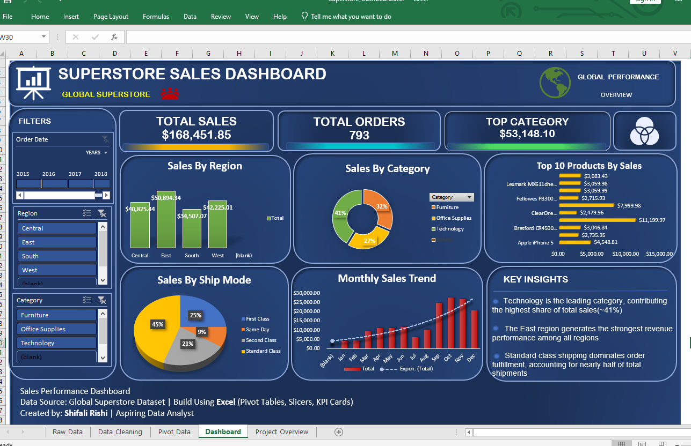

# Superstore Sales Dashboard (Excel)

## Project Overview

This project presents an interactive Excel dashboard analyzing sales performance, regional trends, and product insights using the Global Superstore dataset.

## Dashboard Preview

## Key Insights

• Technology is the leading category contributing the highest share of sales (~41%).

• The East region generates the strongest revenue performance among all regions.

• Standard Class shipping dominates order fulfillment, accounting for nearly half of total shipments.

• Sales show higher growth toward the end of the year based on the monthly sales trend.

## Key Metrics

* Total Sales: $168,451.85
* Total Orders: 793
* Top Category Sales: $53,148.10

## Dashboard Features

* Sales by Region
* Sales by Category
* Top 10 Products by Sales
* Sales by Ship Mode
* Monthly Sales Trend
* Interactive Filters (Year, Region, Category)

## Tools Used

* Microsoft Excel
* Pivot Tables
* Pivot Charts
* Slicers

## Author

Shifali
Entry-Level Data Analyst
